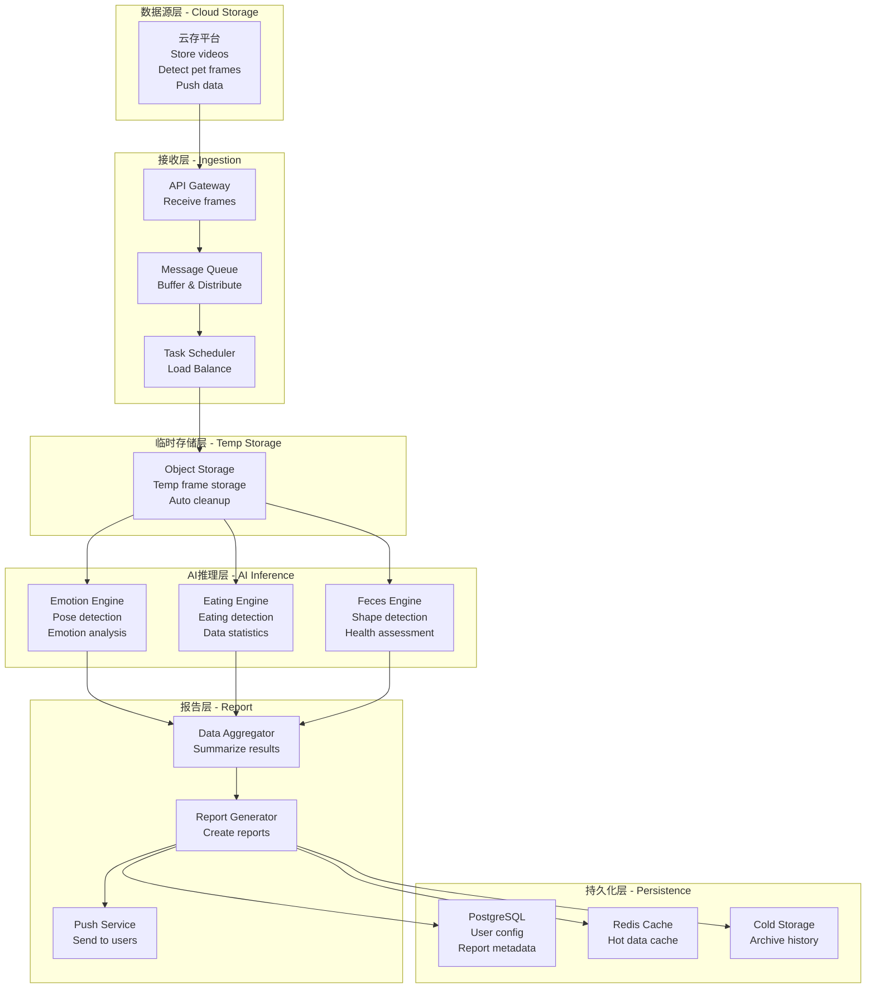

# 宠物AI平台架构设计方案

> 版本：v1.1（修正计算错误）  
> 日期：2026年3月11日  
> 状态：待评审

---

## 一、项目概述

### 1.1 业务背景

基于现有移动云存平台，为开通情绪分析、进食分析、粪便分析服务的用户提供AI分析能力，生成T+1日报告。

### 1.2 核心需求

| 需求项 | 说明 |
|--------|------|
| **用户规模** | 10万开通用户（假设3项服务都开通） |
| **服务类型** | 情绪/行为分析、进食情况分析、粪便健康分析 |
| **数据来源** | 云存平台推送"有宠物"的画面 |
| **报告时效** | T+1（隔天生成） |
| **存储策略** | 临时存储，分析完删除 |

### 1.3 技术约束

| 约束项 | 说明 |
|--------|------|
| **部署环境** | 移动云（子公司3折优惠） |
| **原始视频** | 由云存平台存储，不存储到AI平台 |
| **推送机制** | 云存平台仅推送有宠物的画面 |

---

## 二、负载与资源评估

### 2.1 日处理量计算

```
开通用户：100,000
每用户日帧数（有宠物的画面）：2,000-5,000帧
日总帧数：100,000 × 3,500（中值）= 350,000,000帧
```

### 2.2 GPU处理能力

**单卡L40S性能（混合任务）**：
- YOLOv8n检测：~300 FPS
- 姿态/情绪分类：~200 FPS  
- ResNet50+ArcFace：~150 FPS
- 综合平均：~120 FPS

**单卡24小时处理能力**：
```
= 120 FPS × 24小时 × 3600秒 = 10,368,000帧/天
```

### 2.3 GPU需求计算 ⚠️

```
日处理帧数：350,000,000帧
单卡日处理能力：10,368,000帧

所需GPU数 = 350,000,000 ÷ 10,368,000 = 33.76张

考虑30%冗余 = 33.76 × 1.3 = 43.9张

向上取整：48张L40S
```

### 2.4 GPU配置方案

| 方案 | GPU数量 | 服务器配置 | 处理时间 | 说明 |
|------|---------|-----------|----------|------|
| **推荐方案** | 48张L40S | 4台×12卡 | ~24小时 | 满足需求+冗余 |
| 最小方案 | 36张L40S | 3台×12卡 | ~28小时 | 延长处理窗口 |
| 高性能方案 | 32张H100 | 4台×8卡 | ~17小时 | 更快完成 |

---

## 三、系统架构

### 3.1 整体架构图

```
┌─────────────────────────────────────────────────────────────────────────────┐
│                              移动云存平台（已有）                              │
│  ┌─────────────────────────────────────────────────────────────────────┐   │
│  │  • 存储所有原始视频                                                    │   │
│  │  • 检测"画面改变"和"有宠物"的帧                                        │   │
│  │  • 推送服务：将有宠物的画面推送到AI分析平台                            │   │
│  └─────────────────────────────────────────────────────────────────────┘   │
└───────────────────────────────────┬─────────────────────────────────────────┘
                                    │
                                    │ 推送"有宠物"的画面
                                    │ (估计：2,000-5,000帧/用户/天)
                                    ▼
┌─────────────────────────────────────────────────────────────────────────────┐
│                            AI分析平台（待建）                                 │
│                                                                             │
│  ┌───────────────────────────────────────────────────────────────────────┐ │
│  │                          1. 接收层                                      │ │
│  │  ┌─────────────┐    ┌─────────────┐    ┌─────────────┐               │ │
│  │  │  API网关    │───▶│  消息队列   │───▶│  任务分发    │               │ │
│  │  │ (接收帧)    │    │  (RabbitMQ) │    │  (Celery)    │               │ │
│  │  └─────────────┘    └─────────────┘    └─────────────┘               │ │
│  └───────────────────────────────────────────────────────────────────────┘ │
│                                    │                                        │
│                                    ▼                                        │
│  ┌───────────────────────────────────────────────────────────────────────┐ │
│  │                          2. 临时存储层                                  │ │
│  │  ┌─────────────────────────────────────────────────────────────────┐ │ │
│  │  │  移动云EOS（对象存储）                                             │ │ │
│  │  │  • 存储推送的帧数据（约25TB/天）                                    │ │ │
│  │  │  • 存储中间处理结果                                                │ │ │
│  │  │  • 分析完毕后删除（TTL: 24小时）                                    │ │ │
│  │  └─────────────────────────────────────────────────────────────────┘ │ │
│  └───────────────────────────────────────────────────────────────────────┘ │
│                                    │                                        │
│                                    ▼                                        │
│  ┌───────────────────────────────────────────────────────────────────────┐ │
│  │                          3. GPU推理层                                   │ │
│  │  ┌─────────────────────────────────────────────────────────────────┐ │ │
│  │  │  GPU集群：48×L40S（2,304GB总显存）                                 │ │ │
│  │  │                                                                   │ │ │
│  │  │  ┌─────────────────────────────────────────────────────────┐     │ │ │
│  │  │  │  服务器1 (12×L40S)    服务器2 (12×L40S)                  │     │ │ │
│  │  │  │  • 情绪分析           • 进食分析                          │     │ │ │
│  │  │  │  • YOLOv8n + 姿态     • YOLOv8n + ResNet50                 │     │ │ │
│  │  │  └─────────────────────────────────────────────────────────┘     │ │ │
│  │  │  ┌─────────────────────────────────────────────────────────┐     │ │ │
│  │  │  │  服务器3 (12×L40S)    服务器4 (12×L40S)                  │     │ │ │
│  │  │  │  • 粪便分析           • 备用/扩展                          │     │ │ │
│  │  │  │  • YOLOv8s + ResNet34                                     │     │ │ │
│  │  │  └─────────────────────────────────────────────────────────┘     │ │ │
│  │  │                                                                   │ │ │
│  │  │  总吞吐量：~5,760 FPS（48×120）                                    │ │ │
│  │  │  日处理能力：~4.97亿帧（24小时）                                    │ │ │
│  │  └─────────────────────────────────────────────────────────────────┘ │ │
│  └───────────────────────────────────────────────────────────────────────┘ │
│                                    │                                        │
│                                    ▼                                        │
│  ┌───────────────────────────────────────────────────────────────────────┐ │
│  │                          4. 报告生成层                                  │ │
│  │  ┌─────────────────────────────────────────────────────────────────┐ │ │
│  │  │  Airflow DAG（每日08:00触发）                                      │ │ │
│  │  │  ├── 聚合前一天的分析结果                                          │ │ │
│  │  │  ├── 生成用户报告（情绪/进食/粪便）                                 │ │ │
│  │  │  └── 推送到APP/消息中心                                            │ │ │
│  │  └─────────────────────────────────────────────────────────────────┘ │ │
│  └───────────────────────────────────────────────────────────────────────┘ │
│                                    │                                        │
│                                    ▼                                        │
│  ┌───────────────────────────────────────────────────────────────────────┐ │
│  │                          5. 持久化层                                    │ │
│  │  ┌─────────────┐  ┌─────────────┐  ┌─────────────┐                   │ │
│  │  │ PostgreSQL  │  │   Redis     │  │  EOS(冷)    │                   │ │
│  │  │ (用户/配置) │  │  (缓存/状态)│  │ (报告存档)  │                   │ │
│  │  └─────────────┘  └─────────────┘  └─────────────┘                   │ │
│  └───────────────────────────────────────────────────────────────────────┘ │
└─────────────────────────────────────────────────────────────────────────────┘
```

---

## 四、临时存储需求

### 4.1 存储量计算

| 数据类型 | 日增量 | 说明 |
|----------|--------|------|
| 帧数据 | 18TB | 350M帧 × 50KB |
| AI结果 | 3.5TB | 350M帧 × 10KB |
| 中间文件 | 1.5TB | 处理中间态 |
| 用户报告 | 25GB | 10万用户 × 250KB |
| **总计** | **~23TB** | 分析完删除 |

### 4.2 存储策略

```
临时存储（EOS Standard）：
├── 帧数据：TTL 24小时，处理完立即删除
├── AI结果：TTL 48小时，用于报告生成
└── 中间文件：TTL 12小时

持久存储：
├── 用户报告：30天（用户可选3/7/30天）
└── 元数据：PostgreSQL
```

---

## 五、技术选型

### 5.1 核心组件

| 组件 | 选型 | 版本 | 理由 |
|------|------|------|------|
| **API服务** | Python/FastAPI | 0.104+ | 快速开发、AI生态 |
| **消息队列** | RabbitMQ | 3.12+ | 任务队列、移动云支持好 |
| **任务调度** | Celery + Airflow | 5.3+/2.7+ | 实时任务 + 批处理编排 |
| **GPU推理** | PyTorch + TensorRT | 2.1+/8.6+ | 模型部署、性能优化 |
| **数据库** | PostgreSQL | 15+ | 用户配置、报告元数据 |
| **缓存** | Redis | 7+ | 推理结果缓存、队列状态 |
| **对象存储** | 移动云EOS | - | 临时存储、生命周期管理 |

### 5.2 模型选型

| 服务 | 检测模型 | 分类模型 | 准确率 |
|------|----------|----------|--------|
| **情绪/行为分析** | YOLOv8n | 轻量CNN/ViT-Small | >85% |
| **进食情况分析** | YOLOv8n | ResNet50 + ArcFace | >85% |
| **粪便健康分析** | YOLOv8s | ResNet34 | >80% |

---

## 六、GPU成本对比分析

### 6.1 自建 vs 租用成本对比

#### 方案1：自建GPU集群

| 项目 | 成本 |
|------|------|
| **硬件采购** | |
| L40S GPU × 48 | ¥14,400,000 |
| 服务器机箱 × 4（12卡） | ¥1,600,000 |
| 网络设备 | ¥200,000 |
| **总硬件成本** | **¥16,200,000** |
| **年运维成本** | |
| 电费（24×7×365×50kW × 0.8元/度） | ¥350,400 |
| 机房租金 | ¥200,000 |
| 运维人员（1人） | ¥300,000 |
| 备件更换 | ¥200,000 |
| **年运维总计** | **¥1,050,400** |
| **自建3年TCO** | **¥16,200,000 + ¥1,050,400 × 3 = ¥19,351,200** |

#### 方案2：租用移动云GPU

| 项目 | 成本（原价） | 成本（3折） |
|------|-------------|-------------|
| 48×L40S 按需 | $288,000/月 | $86,400/月 |
| **年租用成本** | **$3,456,000** | **$1,036,800 (¥7,464,960)** |

### 6.2 成本对比结论

| 方案 | 3年TCO | 月均摊 |
|------|--------|--------|
| 自建 | ¥19,351,200 | ¥537,533 |
| **租用（3折）** | **¥22,394,880** | **¥622,080** |

**推荐：租用移动云GPU（3折）**
- 租用虽长期成本略高（+15%），但无需运维负担、灵活扩展
- 自建技术门槛高、运维成本大

---

## 七、成本估算（移动云3折）

### 7.1 月度成本

| 资源项 | 配置 | 原价/月 | 3折后/月 |
|--------|------|---------|----------|
| **GPU计算** | 48×L40S | $288,000 | **$86,400** |
| **临时存储** | 25TB EOS | $458 | **$137** |
| **应用服务器** | 8核16G×10 | $400 | **$120** |
| **数据库** | PostgreSQL RDS | $200 | **$60** |
| **缓存** | Redis 32G | $150 | **$45** |
| **消息队列** | RabbitMQ 3节点 | $150 | **$45** |
| **负载均衡** | SLB | $100 | **$30** |
| **网络带宽** | 20TB/月 | $400 | **$120** |
| **监控/日志** | 云监控 | $100 | **$30** |
| **总计** | - | $289,958 | **$86,987/月** |

### 7.2 年度成本

| 项目 | 月成本 | 年成本 |
|------|--------|--------|
| GPU计算 | $86,400 | $1,036,800 |
| 存储+网络+其他 | $587 | $7,044 |
| **总计** | **$86,987** | **$1,043,844 (¥7,515,677)** |

### 7.3 与原方案对比

| 方案 | 月成本 | 年成本 | 差异 |
|------|--------|--------|------|
| 原方案（部分开通，8卡） | $18,525 | $222,300 | 基准 |
| **修订方案（全量开通，48卡）** | **$86,987** | **$1,043,844** | **+4.7倍** |

---

## 八、扩展规划

### 8.1 用户增长路线

| 阶段 | 用户数 | GPU配置 | 存储需求 | 月成本(3折) |
|------|--------|---------|----------|-------------|
| **当前** | 10万 | 48×L40S | 25TB | $87,000 |
| **6个月** | 20万 | 96×L40S | 50TB | $170,000 |
| **12个月** | 50万 | 240×L40S | 125TB | $420,000 |

### 8.2 成本优化建议

| 优化项 | 当前 | 优化后 | 节省 |
|--------|------|--------|------|
| GPU包年（再省20%） | $86,400 | $69,120 | 20% |
| 模型INT8量化 | - | GPU需求-30% | 30% |
| 处理窗口优化 | 24小时 | 18小时 | GPU-25% |
| **综合优化后** | **$86,987** | **~$50,000** | **43%** |

---

## 九、风险与对策

| 风险 | 概率 | 影响 | 对策 |
|------|------|------|------|
| 用户超预期增长 | 中 | 高 | 预留GPU弹性扩容能力 |
| 云存推送延迟 | 低 | 中 | 延长处理窗口至18小时 |
| 模型准确率不达标 | 中 | 中 | 预留模型优化时间 |
| 移动云服务不稳定 | 低 | 高 | 准备多云备份方案 |
| **GPU库存不足** | 中 | 高 | **提前确认48张L40S库存** |

---

## 十、关键决策点

在实施前，请确认以下几点：

| 问题 | 选项 | 影响 |
|------|------|------|
| **帧推送频率** | 实时推送 vs 批量推送 | 消息队列设计 |
| **峰值处理** | 是否需要白天实时处理？ | GPU配置 |
| **报告内容** | 具体包含哪些指标？ | 模型开发范围 |
| **SLA要求** | 报告生成时间限制？ | 处理窗口 |
| **移动云GPU库存** | 48张L40S是否有库存？ | 最终配置 |

---

## 十一、总结

### 11.1 核心配置

| 项目 | 配置 |
|------|------|
| **GPU** | 48×L40S（4台12卡服务器） |
| **存储** | 25TB EOS（临时，分析完删除） |
| **处理窗口** | 24小时（可压缩至18小时） |
| **月成本** | **$86,987**（3折后）/ **¥626,305** |
| **年成本** | **$1,043,844**（3折后）/ **¥7,515,677** |

### 11.2 成本对比

| 方案 | 3年TCO | 月均成本 |
|------|--------|----------|
| 自建GPU | ¥19,351,200 | ¥537,533 |
| **租用GPU（推荐）** | **¥22,394,880** | **¥622,080** |

### 11.3 下一步

1. **确认移动云GPU库存**：48张L40S是否有库存？
2. **确认最终定价**：3折是否可再议？
3. **确认云存平台推送接口规范**
4. **细化报告内容和指标**
5. **开始详细设计**

---

## 附录A：架构图（Mermaid格式）

### A.1 Mermaid代码（推荐用于Obsidian）



### A.2 使用说明

1. 在Obsidian中直接复制上述Mermaid代码块
2. 切换到阅读模式即可渲染架构图
3. 如需调整样式，可修改subgraph名称和节点文本

---

## 附录B：架构图提示词（用于AI生成图片）

### B.1 通用提示词（适用于Midjourney/DALL-E/Stable Diffusion）

```
Create a professional system architecture diagram for a Pet AI Analysis Platform with the following layers:

Layer 1 - Data Source Layer (Top):
- Cloud Storage Platform icon
- Label: "Cloud Storage - Pet Detection & Push"

Layer 2 - Ingestion Layer:
- API Gateway module
- Message Queue (RabbitMQ) module
- Task Scheduler module
- Arrows showing data flow between them

Layer 3 - Temporary Storage Layer:
- Object Storage (EOS) icon
- Label: "Temp Storage - Auto Cleanup"

Layer 4 - AI Inference Layer (Main):
- Three parallel inference engines:
  * Emotion Analysis Engine (with pet icon)
  * Eating Analysis Engine (with food bowl icon)
  * Feces Health Engine (with health icon)
- GPU cluster indicator: "48x L40S GPUs"

Layer 5 - Report Layer:
- Data Aggregator module
- Report Generator module
- Push Service module

Layer 6 - Persistence Layer (Bottom):
- PostgreSQL database icon
- Redis cache icon
- Cold storage icon

Style requirements:
- Clean, modern tech diagram style
- Blue and white color scheme
- Clear layer separation with rounded rectangles
- Professional icons for each module
- Vertical flow from top to bottom
- High contrast for readability
- Suitable for PowerPoint presentation
- White background
- No text shadows
```

### B.2 简化版提示词（适用于快速生成）

```
Professional cloud architecture diagram showing:
1. Data Source: Cloud storage with pet detection
2. Ingestion: API Gateway → Message Queue → Task Scheduler
3. Storage: Object Storage (temporary)
4. AI Processing: 3 parallel engines (Emotion, Eating, Health) on GPU cluster
5. Report: Aggregator → Generator → Push
6. Persistence: Database, Cache, Archive

Clean tech style, blue theme, layered structure, PowerPoint-ready
```

### B.3 Excalidraw提示词（适用于手绘风格）

```
Draw a system architecture with 6 horizontal layers:

Layer 1 (top): Cloud icon with label "Cloud Storage"
Layer 2: Three boxes connected horizontally - "API Gateway", "Message Queue", "Task Scheduler"
Layer 3: One box labeled "Object Storage (Temp)"
Layer 4: Three boxes side by side - "Emotion AI", "Eating AI", "Health AI" with a note "GPU Cluster"
Layer 5: Three boxes connected - "Aggregate", "Generate Report", "Push"
Layer 6: Three icons - Database, Cache, Archive

Use arrows between layers, hand-drawn style, clean lines
```

---

## 附录C：AI提示词模板（用于重新生成架构）

```
请设计一个宠物AI分析平台，需求如下：

1. 用户规模：10万开通用户
2. 服务类型：情绪分析、进食分析、粪便健康分析
3. 数据来源：云存平台推送"有宠物"的画面
4. 报告时效：T+1（隔天生成）
5. 存储策略：临时存储，分析完删除
6. 部署环境：移动云（3折优惠）

技术约束：
- 日处理帧数：3.5亿帧
- 单卡吞吐量：120 FPS（混合任务）
- 需要48张L40S GPU

请提供：
1. 完整的系统架构图
2. GPU配置和成本分析
3. 存储需求评估
4. 技术栈选型
5. 月度和年度成本估算
```

---

## 附录D：GPU计算详细推导

```
=== 输入参数 ===
开通用户数：100,000
每用户日帧数：3,500（中值）
日总帧数：100,000 × 3,500 = 350,000,000帧

=== 单卡性能 ===
L40S GPU规格：
- 显存：48GB
- YOLOv8n检测：~300 FPS
- 姿态分类：~200 FPS
- ResNet50分类：~150 FPS
- 混合任务平均：~120 FPS

=== 处理能力计算 ===
单卡24小时处理能力：
= 120 FPS × 24小时 × 3600秒
= 120 × 24 × 3600
= 10,368,000帧/天

所需GPU数：
= 350,000,000 ÷ 10,368,000
= 33.76张

考虑30%冗余：
= 33.76 × 1.3
= 43.9张

向上取整：48张（4台12卡服务器）
```

---

## 变更历史

| 版本 | 日期 | 变更内容 |
|------|------|----------|
| v1.0 | 2026-03-11 | 初始版本（GPU计算错误：8张） |
| v1.1 | 2026-03-11 | **修正GPU计算：8张→48张**，重新评估成本 |
| v1.2 | 2026-03-11 | 添加Mermaid架构图和AI提示词，同步到Obsidian |

---

> **文档状态**：已同步至Obsidian  
> **下一步**：确认GPU库存和定价，开始详细设计
